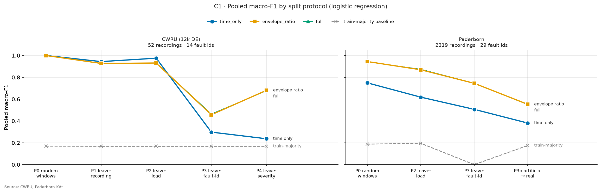
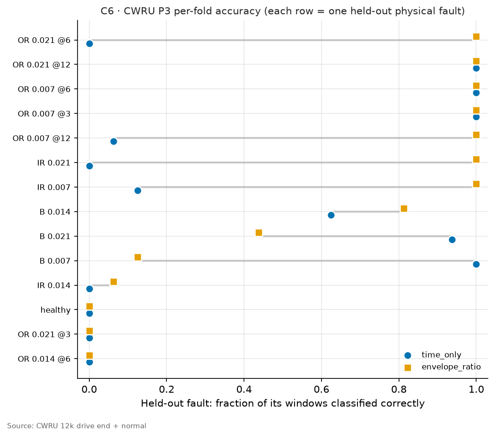
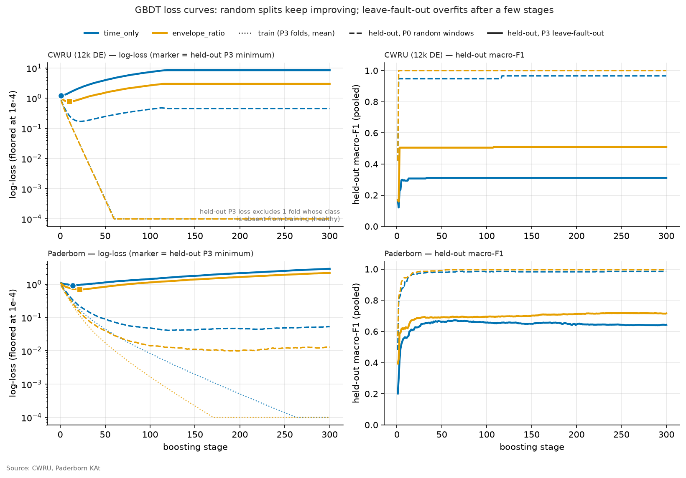
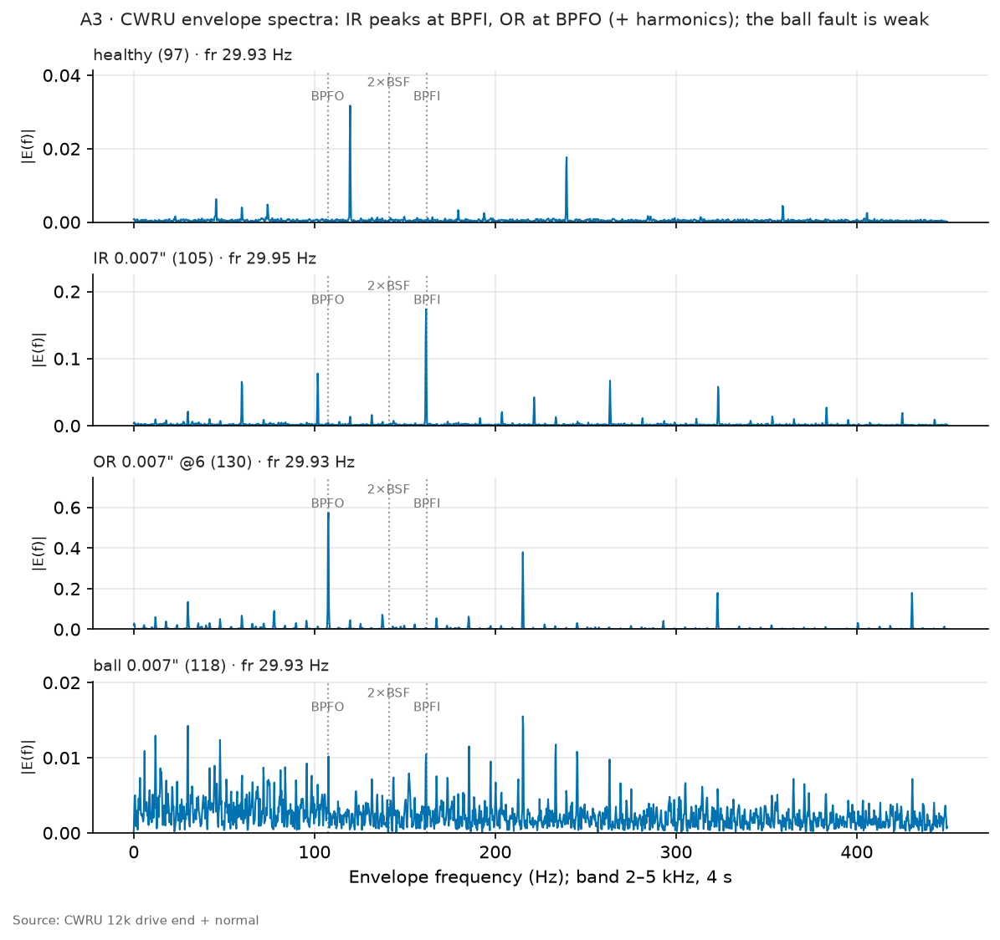
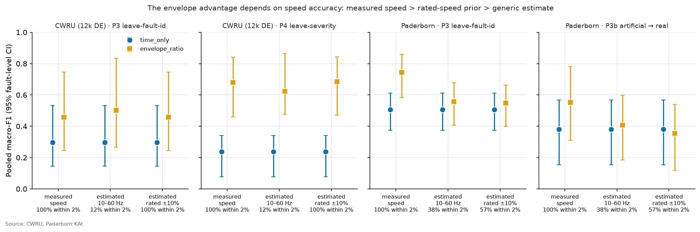

# vibrometer_research: does bearing fault detection survive an honest test?

Vibration-based bearing-fault classifiers routinely report around 99% accuracy on public benchmarks. Most of
those numbers come from **leaky evaluation**: windows cut from the same physical fault end up in both training
and test data, so the model learns to recognise *that bearing* instead of *that kind of fault*. This project
re-evaluates fault detection under splits that hold out whole faults, severities, damage types and datasets.
It asks one question: **which features still work when the test is honest, and can they run on cheap edge
hardware?**

**Short answer:**
- **Leakage inflates scores.** On CWRU, random splits score a perfect 1.000; holding out each physical fault
  drops that to 0.457.
- **Envelope features do better under honest splits.** Envelope features computed at the bearing's
  physics-predicted fault frequencies beat generic time-domain features. On Paderborn the gain is
  **+0.24 macro-F1** (95% CI +0.15 to +0.33).
- **They depend on knowing the shaft speed.** Measured speed works. Speed estimated from the vibration works on
  CWRU with a rated-speed hint but loses most of the gain on Paderborn.
- **The pipeline is cheap.** One low-power Cortex-A55 core of an **Orange Pi 5 Plus** runs it 99× faster than
  real time, and the whole board can serve about **350 sensors**.

📄 **Paper:** [`paper/main.pdf`](paper/main.pdf) (IEEE conference format, 9 pages) ·
📊 **All numbers:** [`results/handoff/summary.md`](results/handoff/summary.md) ·
⚠️ **Every fix and caveat:** [`adjustments_and_cliffs.md`](adjustments_and_cliffs.md)



---

## Contents

1. [The problem: leakage](#1-the-problem-leakage)
2. [Data](#2-data)
3. [Method](#3-method)
4. [Results](#4-results)
5. [Shaft speed: the catch](#5-shaft-speed-the-catch)
6. [Edge deployment on an Orange Pi 5 Plus](#6-edge-deployment-on-an-orange-pi-5-plus)
7. [Limitations](#7-limitations)
8. [Reproducing everything](#8-reproducing-everything)
9. [Repository layout](#9-repository-layout)
10. [How the results are kept honest](#10-how-the-results-are-kept-honest)

---

## 1. The problem: leakage

The **CWRU** (Case Western Reserve University) bearing data are the standard benchmark. Each seeded fault, a
notch of a given size on the inner race, outer race or a ball, is recorded at four motor loads. Each recording
is then cut into many short windows. If training and test windows are drawn at random, both sides contain
windows from the same physical notch, and a classifier can score near-perfectly by memorising each notch's
signature. That says nothing about a bearing it has never seen, which is the only case that matters in a
factory.

So the core design choice here is the **fault identity**: one physical damaged bearing (or one physical
configuration on a single rig). Every split keeps each fault identity, and each recording, entirely on one side.

## 2. Data

| Dataset | Recordings | Fault identities | Classes | Used for |
|---|---|---|---|---|
| **CWRU** 12 kHz drive end + normal baseline | 52 usable | 14 | healthy, inner race, outer race, ball | main results |
| **Paderborn** (KAt) | 2,319 | 29 bearings | healthy, inner race, outer race | main results; artificial → real damage |
| **MaFaulDa** (UFRJ) | 1,951 | 24 configurations | healthy, imbalance (+ others) | imbalance at held-out severity |
| **MFPT** | 20 | 3 | healthy, inner race, outer race | cross-dataset transfer |

Data cleaning that matters:
- **CWRU:** 12 files are excluded as defective. These are clipped or noisy recordings, plus files whose MATLAB
  file contains another file's data. The list extends Smith & Randall (2015).
- **CWRU naming:** downloaded files are numbered (`105.mat`), so a catalog scraped from the CWRU site maps each
  number to its fault, size, load and outer-race position.
- **Paderborn:** bearings with *combined* inner + outer damage (`KB*`) are excluded, since they have no single
  fault class. Paderborn has no ball faults.
- **MaFaulDa:** the `0g/6g/20g/35g` subfolders add imbalance mass to the *same* faulty bearing, so they share
  one fault identity.

## 3. Method

### Features (two sets, compared throughout)
- **`time_only` (17 features):** generic statistics that need no physics. RMS, peak, kurtosis (Pearson), crest
  factor, etc., plus broadband spectral shape (centroid, entropy, flatness, roll-off, band energies).
- **`envelope_ratio` (39 features):** `time_only` plus physics-based features. The signal is band-passed
  (2–5 kHz), demodulated with the Hilbert transform to get its *envelope*, and the envelope's spectrum is
  inspected at the bearing's **kinematic fault frequencies**:

  BPFO = (n·f_r/2)(1 − (d/D)·cos φ), BPFI = (n·f_r/2)(1 + (d/D)·cos φ), and the ball-spin and cage frequencies.

  Here n is the number of balls, d the ball diameter, D the pitch diameter and f_r the shaft rate. Each feature
  is the envelope energy within ±2% of a fault-frequency harmonic, *divided by the total envelope energy*, so it
  is amplitude-independent.
- **`full` (40):** `envelope_ratio` + ISO velocity RMS.

### The split ladder (protocols P0–P5)
| Protocol | Held out | Honest? |
|---|---|---|
| P0 | a random 20% of windows | **No.** It leaks by design and is shown only for contrast |
| P1 | one recording | partly (same fault at other loads stays in training) |
| P2 | one motor load / operating condition | partly (same fault at other loads stays in training) |
| **P3** | **one physical fault identity** | **yes**: the main test |
| **P3b** | Paderborn: train on artificial damage, test on naturally worn bearings | **yes**: the deployment-like test |
| **P4** | one fault size (CWRU) or imbalance mass (MaFaulDa) | **yes** |
| P5 | a whole dataset | yes (transfer) |

Every fold is checked so that no recording, and under P3 no fault identity, sits on both sides; a violation
stops the run. Splits are written to hashed manifests (`configs/frozen/`) before scoring.

### Models and scoring
- **Models:** logistic regression (main) and gradient-boosted trees (GBDT, second). Standardisation is fit on
  training folds only.
- **Pooled macro-F1:** with leave-one-group-out, many folds contain a single class, so per-fold F1 is
  meaningless. All folds' predictions are pooled and scored once.
- **Train-only baseline:** predict the most common *training* label. (An earlier version scored this on the
  test labels and got a fake 1.0.)
- **95% confidence intervals:** 1,000 bootstrap resamples of whole **fault identities**, not windows. The
  envelope − time difference is a *paired* bootstrap, using the same resample for both feature sets.

## 4. Results

Pooled macro-F1 with 95% fault-level CIs, measured shaft speed (`*` = the difference's CI excludes zero):

| Split | Model | envelope_ratio | time_only | Δ envelope − time |
|---|---|---|---|---|
| CWRU · P3 leave-one-fault-out | logistic reg. | 0.457 [0.25, 0.75] | 0.298 [0.15, 0.53] | +0.16 [−0.06, +0.40] |
| CWRU · P4 leave-one-severity-out | logistic reg. | 0.681 [0.46, 0.84] | 0.237 [0.08, 0.34] | **+0.44 [+0.28, +0.61]*** |
| Paderborn · P3 leave-one-bearing-out | logistic reg. | 0.745 [0.58, 0.86] | 0.506 [0.37, 0.61] | **+0.24 [+0.15, +0.33]*** |
| Paderborn · P3b artificial → real | logistic reg. | 0.553 [0.31, 0.78] | 0.381 [0.15, 0.57] | **+0.17 [+0.06, +0.30]*** |
| CWRU · P3 | GBDT | 0.505 [0.25, 0.85] | 0.311 [0.15, 0.55] | +0.20 [−0.09, +0.47] |
| CWRU · P4 | GBDT | 0.748 [0.48, 0.91] | 0.432 [0.13, 0.55] | **+0.32 [+0.10, +0.61]*** |
| Paderborn · P3 | GBDT | 0.700 [0.55, 0.81] | 0.657 [0.51, 0.77] | +0.04 [−0.04, +0.11] |
| Paderborn · P3b | GBDT | 0.587 [0.35, 0.81] | 0.388 [0.19, 0.58] | **+0.20 [+0.08, +0.35]*** |

What this shows:
- **Leakage is large.** CWRU scores 1.000 on random windows (P0) and still 0.93–0.98 when a recording or load
  is held out (P1/P2), because the same physical fault stays in training. Holding out the fault itself (P3)
  drops it to 0.46.
- **Envelope features win on honest splits** in 5 of 8 cases with a significant margin. GBDT closes the gap on
  Paderborn P3 by extracting more from the time-domain features.
- **CWRU P3 isn't significant**, mainly because CWRU has only 14 faults and a single healthy bearing. Healthy
  can't be tested when its only bearing is held out. Averaged over the fault classes only, CWRU P3 scores
  0.609 vs 0.397.
- **Stable across seeds:** across 5 GBDT seeds, P3 macro-F1 moves by at most 0.004.
- **Overfitting is visible in the loss curves.** Under random windows, GBDT's held-out loss keeps falling.
  Under leave-one-fault-out it bottoms out after 1–22 trees and then rises: the extra trees memorise
  training faults.

| | |
|---|---|
|  |  |

**Physical sanity check:** the envelope spectra of real CWRU recordings peak exactly where the bearing
kinematics predict. The inner-race fault peaks at BPFI and the outer-race fault at BPFO and its harmonics. The
ball fault is weak, which matches it being the hardest class.



**Transfer:** trained on Paderborn, envelope features carry over to MFPT (0.81) and CWRU (0.65), while
time-only features reach at most 0.53 on another dataset.
**MaFaulDa:** imbalance stays detectable at held-out masses (0.92–1.00 for every feature set). That task is too
easy to separate the feature sets.

## 5. Shaft speed: the catch

Envelope features need the shaft speed to know *where* the fault frequencies are. Three sources were compared:

| Dataset | Speed source | Windows within 2% of true speed | Δ envelope − time |
|---|---|---|---|
| CWRU | measured (tachometer) | 100% | P4 +0.44 [+0.28, +0.61] |
| CWRU | estimated, searched within ±10% of the rated speed | 100% | P4 +0.45 [+0.29, +0.62] |
| CWRU | estimated, generic 10–60 Hz search | 12% (67% lock to 2×) | P4 +0.39 [+0.22, +0.68] |
| Paderborn | measured | 100% | P3 +0.24 [+0.15, +0.33] |
| Paderborn | estimated, rated ±10% | 57% | P3 +0.04 [−0.03, +0.11] |
| Paderborn | estimated, generic | 38% | P3 +0.05 [−0.02, +0.12] |

**So:**
- **CWRU works without a tachometer** if you tell the estimator the motor's rated speed. The generic search
  locks onto twice the shaft speed, most likely the 60 Hz mains line sitting right at 2 × 29.95 Hz.
- **On Paderborn the shaft line is weak.** The estimator correctly reports low confidence and falls back to
  speed-free features, which removes most of the envelope advantage.

The speed estimator was rewritten against unit tests on synthetic signals (`tests/test_speed.py`). Its
real-data accuracy was measured once, *after* the tests passed, so it was not tuned on these results.



## 6. Edge deployment on an Orange Pi 5 Plus

Target layout: wired sensors stream raw vibration to one **edge gateway** that runs the classifier for all of
them. The gateway is an Orange Pi 5 Plus (Rockchip RK3588: 4 low-power Cortex-A55 + 4 Cortex-A76 cores, 16 GB).

| Feature set | Python, 1 core (per 4 s window) | Windows/s, 8 cores | Sensors served* | C++, one A55 core (per 1.37 s window) | C++, one A76 core | Energy/window (estimated) |
|---|---|---|---|---|---|---|
| time_only | 6.99 ms | 322 | ~645 | 4.43 ms (308× real time) | 0.83 ms | 46.5 mJ |
| envelope_ratio | 18.77 ms | 177 | ~353 | 13.74 ms (99× real time) | 3.16 ms | 85.0 mJ |

\*At one 4 s window per sensor every 2 s; compute only, no network or I/O.

**Details:**
- **The C++ version** is a port of the pipeline originally written for a microcontroller (`firmware/`). It's
  checked against Python: identical predictions, and in-band features within 4×10⁻⁴ in model units.
- **Times are measured on the board.**
- **Energy is estimated**: full-load board power from a published measurement, divided by throughput.
- **Simulated sensor:** each signal is also passed through a simulated low-cost sensor (6 kHz low-pass,
  26.7 kSPS, MEMS noise). On Paderborn this costs time-only features 0.51 → 0.42, while envelope features hold
  at 0.75.
- **Model size:** the envelope model is 238 parameters with a 156-byte feature vector.

## 7. Limitations

- **Few independent faults:** CWRU has 14 and Paderborn 29, so the confidence intervals are wide.
- **Speed:** the envelope advantage needs measured speed, or on CWRU a rated-speed hint.
- **One healthy CWRU bearing:** healthy can't be tested under P3.
- **Energy is estimated**, not measured. A microcontroller (on-sensor) implementation exists in `firmware/`
  but wasn't measured.
- **Simulated sensor:** the deployment view is simulated, and Paderborn's signal units are undocumented.
- **MaFaulDa:** no licence is stated, and its cage faults are counted as outer race.

All of these, and every fix made along the way, are listed in
[`adjustments_and_cliffs.md`](adjustments_and_cliffs.md).

## 8. Reproducing everything

```bash
make setup                 # pip install -r requirements.txt + the package
make data                  # download CWRU, Paderborn, MaFaulDa, MFPT (~44 GB), sha256 recorded
make reproduce             # re-extract all features, rerun every experiment (~10 min), redraw, write provenance
make handoff               # results/handoff/summary.md: every number, read from the result files
make paper                 # paper/main.pdf (needs tectonic: brew install tectonic)
make check                 # tests
```

Single pieces: `python3 scripts/run_real.py --only {cwru,paderborn,mafaulda,gbdt,curves,speed,deploy,transfer,cost}`.

**Orange Pi gateway benchmark** (no dataset needed; 32 real windows are bundled):
```bash
make pi-push PI=orangepi@<ip>      # rsync the repo to the board
# on the board:  pip install -r requirements.txt && make gateway
make pi-pull PI=orangepi@<ip>      # bring results/real/gateway_*.json back
```

## 9. Repository layout

```
src/vibedge/
  datasets/          loaders: CWRU (+ file catalog, KNOWN_BAD), Paderborn, MaFaulDa, MFPT, synthetic
  features/          time-domain, spectral, envelope, bearing kinematics
  splits.py          the split ladder, leakage checks, frozen manifests
  evaluate.py        pooled scoring, train-only baseline, fault-level bootstrap
  speed.py           shaft-speed estimator
  real_experiments.py  every real-data experiment
  device_ref.py      reference of the exact on-device algorithm
scripts/             run_real.py, make_paper.py, make_handoff.py, bench_gateway.py, download_data.py, …
results/real/        every result as JSON (the source of all numbers)
figures/real/        result figures, each with a JSON of its plotted values
paper/               IEEE paper: main.tex, generated tables/numbers, figures, main.pdf
firmware/            C++ port (ESP32 / native), parity check, power-meter sketch
configs/frozen/      pre-registered split manifests
tests/               the author's verification tests
```

## 10. How the results are kept honest

- **Generated numbers:** the paper's numbers and tables are generated from `results/real/*.json` by
  `scripts/make_paper.py`; none is typed by hand.
- **Leakage checks:** every split is checked for leakage, and splits are frozen before scoring.
- **Fault-level intervals:** confidence intervals resample whole faults, not windows, so they don't overstate
  certainty.
- **Provenance:** `make reproduce` records the commit, package versions and data hashes in
  `results/real/provenance.json`.
- **Tests:** the shaft-speed estimator and the bootstrap were fixed against tests written first, and the
  real-data effect was measured once afterwards.

### Datasets and licences
CWRU: [engineering.case.edu/bearingdatacenter](https://engineering.case.edu/bearingdatacenter) ·
Paderborn: [groups.uni-paderborn.de/kat/BearingDataCenter](https://groups.uni-paderborn.de/kat/BearingDataCenter/) (CC BY-NC 4.0) ·
MaFaulDa: [UFRJ](http://www02.smt.ufrj.br/~offshore/mfs/page_01.html) (no licence stated) ·
MFPT: third-party mirror (`emperorpein/mfpt-fault-datasets` on Kaggle). Raw data are not in this repository.
